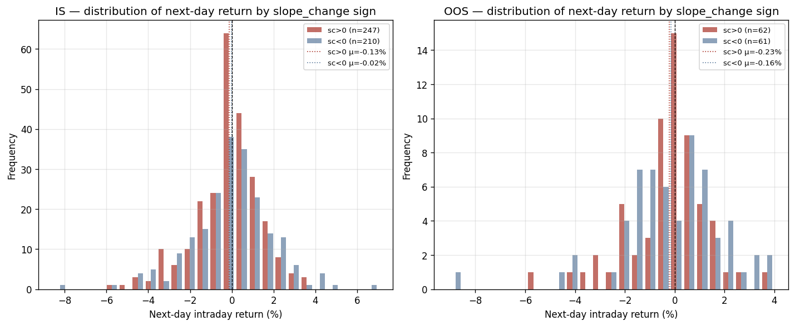
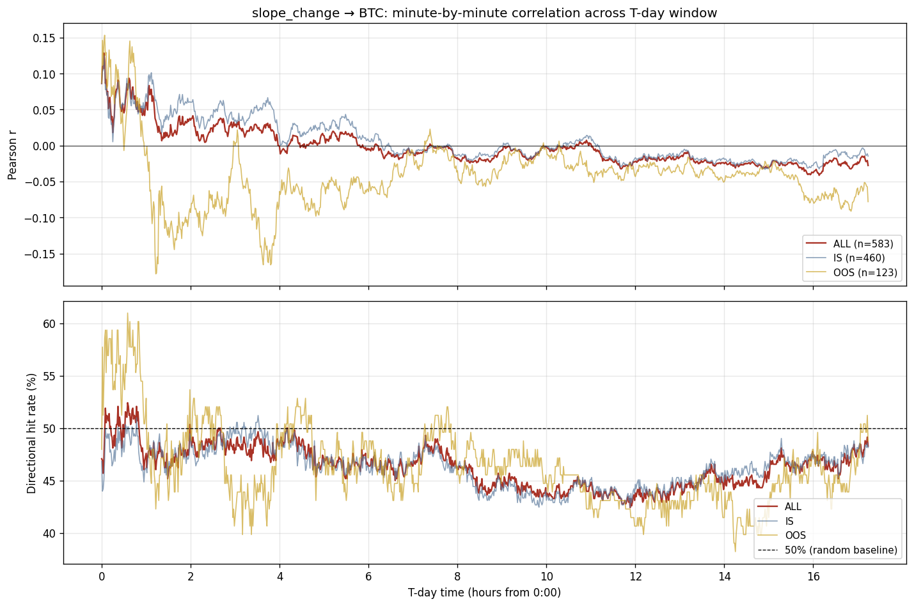
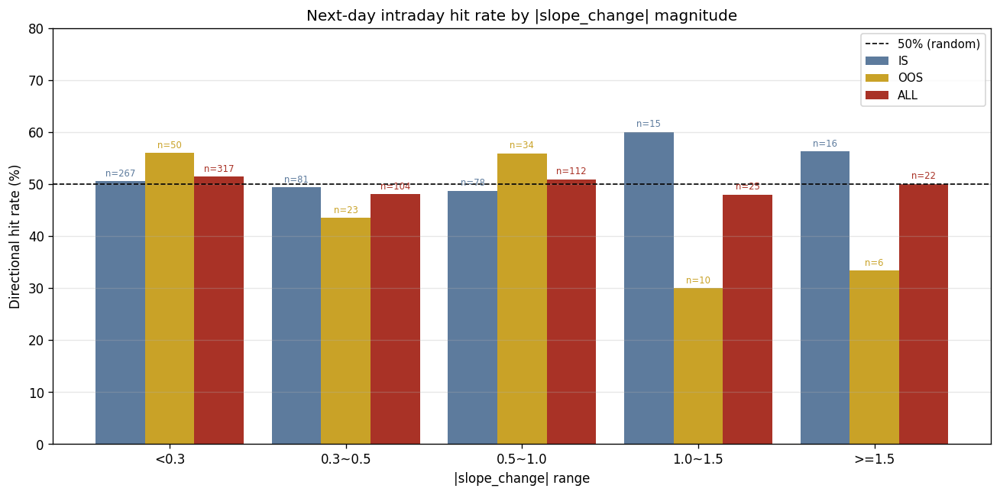

# VIX slope_change 방향 예측 검증 보고서

> 작성일: 2026-06-02 (T-day 시간축 적용)
> 대상 독자: 금융공학 / 데이터사이언스 입문 수준의 대학생
> 목적: slope_change 아이디어가 어떻게 탄생했고, 어떤 기준으로 검증되었으며, 최종적으로 어떤 결론에 도달했는지 전 과정을 서술한다.

---

## 목차

1. [배경 — 왜 VIX에 주목했는가](#1-배경--왜-vix에-주목했는가)
2. [출발점 — 논문이 발견한 것](#2-출발점--논문이-발견한-것)
3. [핵심 개념 설명](#3-핵심-개념-설명)
4. [slope_change 아이디어의 탄생](#4-slope_change-아이디어의-탄생)
5. [시간축의 재정의 — T-day 개념](#5-시간축의-재정의--t-day-개념)
6. [검증 설계 — 처음부터 Lookahead-free 구조](#6-검증-설계)
7. [1단계 — slope 계산이 논문과 동일한가](#7-1단계--slope-계산이-논문과-동일한가)
8. [2단계 — 다음 장중 적중률 (slope_change 본래 가설)](#8-2단계--다음-장중-적중률)
9. [3단계 — T-day 윈도우 분 단위 분석](#9-3단계--t-day-윈도우-분-단위-분석)
10. [4단계 — |slope_change| 크기별 적중률](#10-4단계--slope_change-크기별-적중률)
11. [전체 흐름 요약](#11-전체-흐름-요약)
12. [최종 결론](#12-최종-결론)
13. [부록 — 용어 사전](#13-부록--용어-사전)

---

## 1. 배경 — 왜 VIX에 주목했는가

### 1.1 BTC는 심리에 극도로 민감하다

비트코인(BTC)은 주식이나 채권과 근본적으로 다르다. 주식에는 기업 이익이, 채권에는 이자가 있어 가격을 뒷받침하는 '내재 가치(intrinsic value)'가 존재한다. BTC에는 그런 기초 체력이 없다. 대신 BTC 가격은 **시장 참여자들의 심리 — 공포와 탐욕 — 에 극도로 민감하게 반응**한다.

이 특성 때문에 연구자들은 자연스럽게 다음 질문에 이르렀다:

> "시장의 공포 수준을 나타내는 지표가 있다면, 그것이 BTC 가격 방향을 예측하는 데 쓰일 수 있지 않을까?"

그 지표가 바로 **VIX**다.

### 1.2 VIX란 무엇인가

VIX(Volatility Index)는 미국 시카고옵션거래소(CBOE)가 산출하는 지수로, **S&P 500이 앞으로 30일 동안 얼마나 크게 흔들릴 것인지에 대한 시장의 기대치**를 나타낸다.

- **VIX가 높다**: 투자자들이 시장 급등락을 두려워하고 있다 → **공포 상태**
- **VIX가 낮다**: 투자자들이 시장을 안정적으로 본다 → **안도 상태**

VIX는 흔히 **"공포 지수(Fear Index)"** 라고 불린다.

### 1.3 VIX와 BTC의 관계

직관적으로 생각하면:

- 주식시장 투자자들이 공포를 느끼면(VIX 상승), 주식을 팔고 안전 자산으로 이동한다.
- BTC는 고위험 자산(risk asset)으로 분류된다.
- 따라서 VIX가 올라가면 → BTC도 하락 압력을 받을 가능성이 높다.

---

## 2. 출발점 — 논문이 발견한 것

### 2.1 논문 개요

| 항목 | 내용 |
|------|------|
| 제목 | Volatility Transmission to Bitcoin: The Role of VIX Term Structure and Crypto Options Markets |
| 저자 | Jie Luo, Wei-Tse Tsai, Kuang-Chieh Yen |
| 게재 | SSRN Preprint (2026) |
| 분석 기간 | 2021년 3월 ~ 2025년 5월 (1,028 거래일) |

### 2.2 논문이 한 일: VIX 기간 구조 분석

논문은 VIX를 만기별 구조(term structure)로 바라봤다.

| 지표 | 의미 |
|------|------|
| VIX (30일) | 향후 30일 변동성 예상 |
| VIX3M (3개월) | 향후 3개월 변동성 예상 |

논문은 PCA(주성분 분석)로 VIX 기간 구조를 두 성분으로 압축했다:

| PCA 성분 | 별명 | 분산 설명력 |
|----------|------|-------------|
| PCA1 | Level (수준) | 96.17% |
| PCA2 | Slope (기울기) | 3.51% |

### 2.3 논문의 핵심 발견

> **"PCA1(전체 공포 수준)보다 PCA2(기울기)가 같은 날 BTC 수익률을 2.3배 더 잘 설명한다."**

그러나 결정적 단서:

> **"이 관계는 '당일(contemporaneous)' 관계만 유의하고, 시차(lagged) 효과는 없다."**

트레이딩 전략이 되려면 **시차 예측**이어야 한다 — 오늘 아침에 "어제 VIX가 어땠다"는 정보로 오늘 포지션을 결정해야 하기 때문이다. 이미 지나간 오늘의 VIX로는 아무것도 할 수 없다.

---

## 3. 핵심 개념 설명

### 3.1 Slope — VIX 기간 구조의 기울기

```
slope = VIX3M - VIX
      = (3개월 VIX 종가) - (30일 VIX 종가)
```

- slope > 0 → **Contango** (정상 상태, 장기 불안)
- slope < 0 → **Backwardation** (위기 상태, 단기 공포)

### 3.2 slope_change — 기울기의 하루 변화량

```
slope_change = slope[오늘] - slope[어제]
```

"어제와 비교해 오늘 VIX 기간 구조의 기울기가 얼마나 달라졌는가"를 나타낸다.

### 3.3 방향 적중률 (Directional Accuracy)

```
방향 적중률 = (예측 방향과 실제 방향이 일치한 날 수) / (전체 거래일 수)
```

**기준선은 50%**: 동전 던지기 수준. 따라서 **50% 이하는 정보 가치 없음**.

---

## 4. slope_change 아이디어의 탄생

### 4.1 논문에서 한 발 더 나아간 생각

논문은 slope의 **수준(level)**이 BTC와 관계가 있다고 했다. 이 프로젝트에서는 다른 각도로 접근했다:

> "slope의 수준이 아니라, slope가 **변하는 방향**이 더 강한 신호가 아닐까?"

직관:
- 오늘 slope = +5인 사실보다, "어제 +2였는데 오늘 +5가 됐다"는 **변화** 정보가 더 새롭다.
- 시장은 이미 알려진 정보보다 **새로운 정보**에 반응한다.

### 4.2 트레이딩 규칙 도출

```
slope_change > 0  →  Long BTC  (매수)
slope_change < 0  →  Short BTC (매도)
```

**Long 근거** (slope_change > 0):
- slope가 커지는 방향 = contango 심화 = VIX 기간 구조가 정상화되는 방향
- 단기 공포(VIX 30일)가 장기(VIX3M) 대비 상대적으로 줄어드는 중
- 이는 **risk-on** 분위기 → 위험 자산(BTC) 상승 압력

**Short 근거** (slope_change < 0):
- slope가 줄어드는 방향 = backwardation 방향
- 단기 공포 증가 → **risk-off** 분위기 → BTC 하락 압력

---

## 5. 시간축의 재정의 — T-day 개념

### 5.1 왜 새 시간축이 필요한가

VIX 종가는 절대 시각 **16:15 ET**에 확정된다. BTC는 그 후 24시간 계속 거래된다. 이 시간 구조를 분석에 반영하려면 절대 시각(16:15, 09:30 등)으로 표현해도 되지만, 그러면 lookahead-free 구조가 시각적으로 드러나지 않는다.

본 분석은 이를 해결하기 위해 **T-day 시간축**을 도입한다.

### 5.2 T-day 시간축 정의

각 거래일을 "T일"이라는 인덱스로 매핑하고, T일의 시간 t는 **0:00에서 시작**한다.

```
T일의 0:00  ≡  절대 시각 16:16 ET (slope_change(T) 확정 직후 첫 BTC 측정)
T일의 17:14 ≡  절대 시각 익일 09:30 ET (다음 미국 시장 개장)
T일의 23:43 ≡  절대 시각 익일 15:59 ET (다음 미국 시장 마감 직전)
```

구체적인 예시:

| T-day 시각 | 실제 시각 (절대) |
|-----------|----------------|
| T=0 의 0:00 | 2024-01-02 16:16 ET |
| T=0 의 17:14 | 2024-01-03 09:30 ET (다음 장 개장) |
| T=0 의 23:43 | 2024-01-03 15:59 ET (다음 장 마감) |
| T=1 의 0:00 | 2024-01-03 16:16 ET (새 T-day 시작) |

### 5.3 이 시간축에서 slope_change(T)의 위치

- slope_change(T) = slope[T] - slope[T-1]
- slope[T]는 절대 시각 T일 16:15 ET에 확정 = **T일 0:00 직전**
- 따라서 slope_change(T)는 T일 0:00 직전에 확정 → **T-day의 모든 측정 시점(t > 0:00)에서 사용 가능**

이로써 **예측 변수가 종속 변수보다 시간상 항상 선행**하는 구조가 시간축 정의로부터 자명하게 보장된다. **Lookahead bias는 발생할 수 없다.**

---

## 6. 검증 설계

### 6.1 데이터

| 데이터 | 출처 | 빈도 | 비고 |
|--------|------|------|------|
| VIX, VIX3M | CBOE | 일별 | 절대 16:15 ET 확정 (= T일 0:00 직전) |
| BTC 가격 | Binance | 1분봉 | tz = America/New_York, 24h |

### 6.2 분석 구간

| 구간 | 기간 | T-day 수 |
|------|------|----------|
| IS (In-Sample) | 2024-01-02 ~ 2025-10-31 | 460 |
| OOS (Out-of-Sample) | 2025-11-01 ~ 2026-04-30 | 123 |
| ALL | 2024-01-02 ~ 2026-04-30 | 583 |

### 6.3 종속 변수

본 보고서는 두 가지 측정 방식을 비교한다:

**(1) 다음 장중 수익률** — slope_change의 본래 가설

```
next_intraday(T) = (BTC[T, 23:43] - BTC[T, 17:14]) / BTC[T, 17:14]
                 = (다음 미국 장 종료 BTC - 다음 미국 장 시작 BTC) / 다음 미국 장 시작 BTC
```

이는 기존 보고서의 검증 방식과 동일하다 (다음 거래일 09:30→15:59 장중 수익률).

**(2) T-day 윈도우 분 단위 누적 수익률** — VIX duration 분석과 통일

```
r_t(T) = (BTC[T, t] - BTC[T, 0:00]) / BTC[T, 0:00]
       에서 t = 0:01, 0:02, ..., 17:14
```

vix_duration 분석에서 사용한 1,035개 시점과 동일하다.

### 6.4 적중률 정의

```
예측 부호 = sign(slope_change(T))
실제 부호 = sign(종속 변수)
적중 = 예측 부호 == 실제 부호
```

기준값 50%는 무작위(동전 던지기)에 해당한다.

---

## 7. 1단계 — slope 계산이 논문과 동일한가

논문에서 slope = VIX3M - VIX. `vix_slope_daily.parquet`의 `slope` 컬럼이 이 공식과 정확히 일치하는지 검증했다.

```python
vix["slope_check"] = vix["vix3m"] - vix["vix"]
diff = (vix["slope"] - vix["slope_check"]).abs()
```

결과:
```
최대 차이: 0.0000000000
평균 차이: 0.0000000000
✅ slope = VIX3M - VIX 정확히 일치
```

**slope 계산은 논문과 완전히 동일하다.**

---

## 8. 2단계 — 다음 장중 적중률

slope_change의 본래 검증 가설: "slope_change(T)가 다음 미국 장중(T일 17:14 → 23:43) BTC 방향을 예측한다."

### 8.1 핵심 결과

| 구간 | n | 적중률 | binomial p | Long n | Long 적중률 | Short n | Short 적중률 |
|------|----|--------|------------|--------|-----------|---------|------------|
| IS | 457 | **50.5%** | 0.852 | 247 | 51.4% | 210 | 49.5% |
| OOS | 123 | **50.4%** | 1.000 | 62 | 50.0% | 61 | 50.8% |
| **ALL** | **580** | **50.5%** | **0.836** | 309 | 51.1% | 271 | 49.8% |

**세 구간 모두 적중률 ≈ 50.5%** — 무작위 수준이다. binomial test의 p-value도 모두 0.5에서 의미 있게 벗어나지 않는다.

### 8.2 다음 장중 수익률 분포



좌: IS 구간. slope_change > 0(빨강)과 slope_change < 0(파랑) 두 그룹의 다음 장중 수익률 분포가 거의 동일하다. 가설대로라면 빨강 분포가 오른쪽으로 치우쳐야 하지만 그렇지 않다.

우: OOS 구간. 동일한 패턴. 평균은 두 그룹 모두 -0.1 ~ -0.2% 부근으로, 부호 분리가 없다.

### 8.3 해석

slope_change의 부호와 다음 장중 BTC 방향 사이에 **통계적으로 유의한 관계가 없다**. 적중률 50.5%는 실전 트레이딩 신호로 사용할 수 없다.

---

## 9. 3단계 — T-day 윈도우 분 단위 분석

vix_duration 분석과 동일한 시간축에서 slope_change의 예측력을 분 단위로 추적했다 (T-day 0:00 ~ 17:14, 1,035개 시점).

### 9.1 분 단위 상관·적중률 곡선



상단: 분 단위 상관계수 r. ALL(Crimson), IS(Steel Blue), OOS(Gold) 세 곡선 모두 0 부근에서 약하게 흔들린다.

하단: 분 단위 방향 적중률. **세 구간 모두 50% 점선 부근에서 거의 움직이지 않는다.**

### 9.2 핵심 T-day 시점 (ALL 구간, n=580)

| T-day 시각 | 적중률 | binom p | Pearson r | 판정 |
|-----------|--------|---------|-----------|------|
| 0:15 | 48.1% | 0.383 | +0.018 | NS |
| 0:30 | 49.1% | 0.709 | +0.045 | NS |
| 1:00 | 47.6% | 0.262 | +0.060 | NS |
| 2:00 | 49.3% | 0.771 | +0.035 | NS |
| 4:00 | 48.6% | 0.533 | -0.002 | NS |
| 8:00 | 46.2% | 0.074 | -0.017 | NS |
| 12:00 | **43.8%** | **0.003** | -0.022 | 가설과 반대 |
| 17:14 | 48.3% | 0.430 | -0.028 | NS |

**관찰 1**: 어느 시점도 적중률이 50%를 의미 있게 상회하지 않는다. 즉 어떤 호라이즌에서도 예측력이 없다.

**관찰 2**: T-day 12:00 (절대 익일 04:15 ET)에서 적중률 43.8%, p=0.003 (50%보다 낮은 방향). 이는 가설(slope_change > 0 → 상승)과 반대 방향이다. 단일 시점 결과이므로 다중검정 보정 시 유의하지 않을 가능성이 높지만, 어쨌든 가설을 지지하지는 않는다.

**관찰 3**: 평균 적중률은 ALL 구간 약 47%, IS 47%, OOS 49% 수준 — 모두 **50% 이하**다.

---

## 10. 4단계 — |slope_change| 크기별 적중률

"신호가 강할수록(|slope_change|가 클수록) 적중률이 높을까?"

### 10.1 결과



| |slope_change| 범위 | IS 적중률 (n) | OOS 적중률 (n) | ALL 적중률 (n) |
|-------------------|-------------|--------------|--------------|
| < 0.3 | 50.6% (267) | 56.0% (50) | 51.4% (317) |
| 0.3 ~ 0.5 | 49.4% (81) | 43.5% (23) | 48.1% (104) |
| 0.5 ~ 1.0 | 48.7% (78) | 55.9% (34) | 50.9% (112) |
| 1.0 ~ 1.5 | 60.0% (15) | **30.0% (10)** | 48.0% (25) |
| ≥ 1.5 | 56.2% (16) | **33.3% (6)** | 50.0% (22) |

### 10.2 해석

**ALL 구간**: 모든 크기 구간에서 적중률 48~51% (무작위 수준).

**IS와 OOS의 불일치**: |slope_change| ≥ 1.0 같은 "강한 신호" 구간에서 IS는 60%/56%를 보이지만, OOS는 30%/33%로 정반대다. 이는:

1. IS 표본이 작아(n=15, 16) 우연한 패턴이 잡혔을 가능성.
2. OOS에서 정반대 결과로 가설이 무너짐.
3. ALL 구간 종합 시 약 48~50% 수준의 무작위로 수렴.

→ **"강한 신호일수록 정확도가 높다"는 가설은 데이터로 지지되지 않는다.**

---

## 11. 전체 흐름 요약

```
[STEP 1] 논문 발견
  "VIX slope factor가 BTC 수익률과 당일 강한 관계 (r=-0.67)"
  단, 논문 자체가 밝힘: "시차 예측력은 없다"
              ↓
[STEP 2] 아이디어 도출
  "slope 수준보다 slope의 변화율(slope_change)이 더 강한 신호?"
  규칙: sc(T) > 0 → Long / sc(T) < 0 → Short
              ↓
[STEP 3] T-day 시간축 도입
  슬립_change(T)가 T-day 0:00 직전에 확정
  → T-day의 모든 측정 시점에서 lookahead-free 사용 가능
              ↓
[STEP 4] slope 계산 검증
  slope = VIX3M - VIX → 논문과 완전히 일치 ✅
              ↓
[STEP 5] 다음 장중 적중률 측정
  IS = 50.5%, OOS = 50.4%, ALL = 50.5%
  → 무작위 수준, binomial test p > 0.8
              ↓
[STEP 6] T-day 윈도우 분 단위 분석
  1,035개 시점 전부 적중률 50% 부근
  T-day 12:00에서 가설과 반대 방향 (단일 시점)
              ↓
[STEP 7] |slope_change| 크기별 분석
  ALL 구간 모든 크기 구간에서 48~51% 수준
  IS의 "강한 신호" 패턴은 OOS에서 정반대 → 우연
              ↓
[CONCLUSION]
  slope_change는 BTC 방향 예측 신호로 사용 불가
  논문의 "시차 예측력 없음" 결론과 일치
```

---

## 12. 최종 결론

### 12.1 slope 계산

- `slope = VIX3M - VIX` — 논문과 완전히 동일. **오류 없음. ✅**

### 12.2 방향 예측력

T-day 시간축의 lookahead-free 설계에서 측정한 결과:

| 측정 방식 | IS | OOS | ALL |
|----------|-----|------|------|
| 다음 장중 적중률 | 50.5% | 50.4% | 50.5% |
| T-day 윈도우 분 단위 평균 적중률 | ~47% | ~49% | ~47% |
| |slope_change| 크기별 패턴 | 일관성 없음 | OOS에서 IS와 정반대 | 무작위 수준 |

**모든 측정에서 50% 부근.**

### 12.3 왜 이런 결과가 나왔는가

논문이 처음부터 밝힌 대로:

> "VIX slope와 BTC의 관계는 **동시적(contemporaneous) 관계만 유의하고, 시차(lagged) 효과는 없다**."

slope_change(T)는 시차 예측을 시도한 것이고, 결과는 논문의 예측대로 예측력 없음으로 나왔다.

### 12.4 핵심 교훈

**상관관계가 강해도 시차 예측력은 별개다.**

| 구분 | 설명 | 트레이딩 가능 여부 |
|------|------|-----------------|
| 동시적 관계 (contemporaneous) | 같은 날 X와 Y가 함께 변한다 | ❌ 불가 |
| 시차 예측 (lagged prediction) | 어제 X가 변했으니 오늘 Y가 변할 것이다 | ✅ 가능 |

논문이 발견한 것은 전자였고, 트레이딩 전략은 후자를 요구한다. 이 간극이 slope_change 전략이 실패한 근본 원인이다.

---

## 13. 부록 — 용어 사전

| 용어 | 설명 |
|------|------|
| **VIX** | CBOE 변동성 지수. S&P 500의 향후 30일 예상 변동성. "공포 지수". |
| **VIX3M** | VIX의 3개월 만기 버전. |
| **Slope (기울기)** | `slope = VIX3M - VIX`. VIX 기간 구조의 기울기. |
| **slope_change** | `slope_change = slope[T] - slope[T-1]`. 기울기의 일별 변화량. |
| **Contango** | slope > 0. 장기 변동성이 단기보다 높음 (정상). |
| **Backwardation** | slope < 0. 단기가 장기보다 높음 (위기). |
| **T-day** | 본 분석에서 정의한 시간 단위. 0:00에 시작해 23:59에 끝남. 각 거래일의 VIX 종가 확정 직후부터 다음 VIX 종가 확정 직전까지의 구간. |
| **T-day 0:00** | 절대 시각 16:16 ET (slope_change(T) 확정 직후). |
| **T-day 17:14** | 절대 시각 익일 09:30 ET (다음 미국 시장 개장). |
| **T-day 23:43** | 절대 시각 익일 15:59 ET (다음 미국 시장 마감 직전). |
| **다음 장중 수익률** | T-day 17:14 → 23:43의 BTC 수익률 (= 다음 미국 시장 장중 6h 29m 수익률). |
| **Lookahead Bias** | 분석 시점에 알 수 없는 미래 데이터 사용 오류. T-day 시간축에서 구조적 배제. |
| **Contemporaneous (동시적) 관계** | 같은 시점의 관계. 거래 불가. |
| **Lagged (시차) 예측** | 시간 차이가 있는 관계. 거래 가능. |
| **방향 적중률** | 예측 방향과 실제 방향의 일치 비율. 50%가 무작위 기준. |
| **Binomial test** | 적중률이 50%와 의미 있게 다른지 확인하는 통계 검정. |
| **IS (In-Sample)** | 전략 개발 구간. |
| **OOS (Out-of-Sample)** | 검증 전용 구간. |

---

## 파일 목록

| 파일 | 설명 |
|------|------|
| `slope_change_report.md` | 본 보고서 |
| `slope_change_analysis.py` | T-day 시간축 분석 스크립트 |
| `charts/slope_change_minute_metrics.png` | 분 단위 상관·적중률 곡선 |
| `charts/slope_change_magnitude_hit.png` | |slope_change| 크기별 적중률 |
| `charts/slope_change_return_distribution.png` | 다음 장중 수익률 분포 (sc 부호별) |
| `data/slope_change_minute_metrics.csv` | 분 단위 원자료 (1,035개 시점) |
| `data/slope_change_summary.json` | 핵심 수치 요약 |
| `archive/` | 이전 분석 (참고용) |
