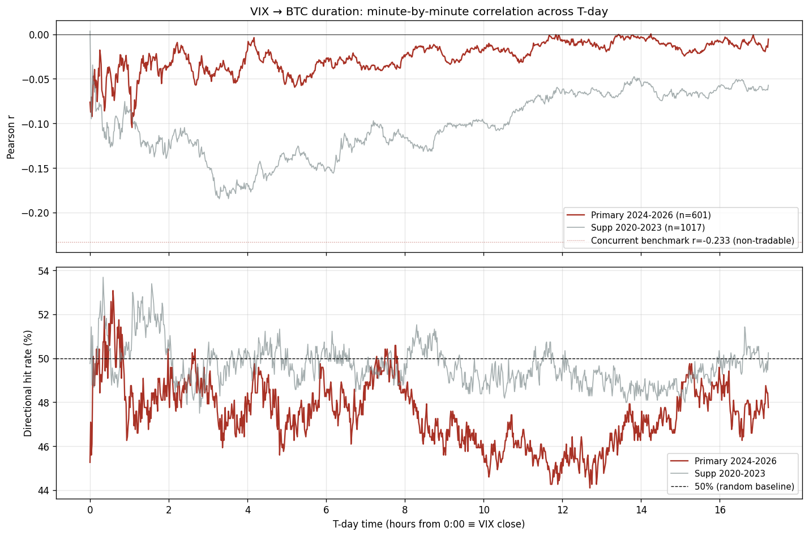
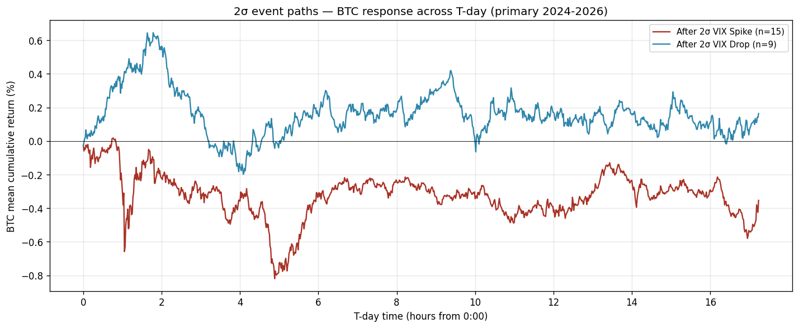

# VIX → BTC 영향력 유효시간(Duration) 분석 — 최종 보고서

> 작성일: 2026-06-02
> 대상 독자: 금융공학 / 데이터사이언스 입문 수준의 대학생
> 목적: "VIX의 영향이 BTC에 얼마나 오래 남아 예측에 쓸 수 있는가"를 검증한 과정과 결론을 처음부터 끝까지 서술한다.

---

## 목차

1. [배경 — 왜 'Duration(유효시간)'을 측정하는가](#1-배경)
2. [시간축의 재정의 — T-day 개념](#2-시간축의-재정의--t-day-개념)
3. [핵심 아이디어 — 시간의 비대칭성](#3-핵심-아이디어)
4. [선행 연구와의 관계](#4-선행-연구와의-관계)
5. [핵심 개념 설명](#5-핵심-개념-설명)
6. [분석 설계 — 처음부터 Lookahead 없는 구조](#6-분석-설계)
7. [방법론](#7-방법론)
8. [결과 — 분 단위 상관·적중률 분석](#8-결과--분-단위-상관적중률-분석)
9. [결과 — 2σ 이벤트 스터디](#9-결과--2σ-이벤트-스터디)
10. [종합 해석](#10-종합-해석)
11. [최종 결론](#11-최종-결론)
12. [부록 — 용어 사전](#12-부록--용어-사전)

---

## 1. 배경

### 1.1 BTC와 VIX의 동시 관계 — 그리고 그 한계

기존 연구들은 다음을 보고했다:

> **"VIX와 BTC는 같은 날 강한 음의 관계를 보인다. VIX가 오르는 날에는 BTC가 떨어진다."**

수치로: 같은 날 VIX 변화율과 BTC 일별 수익률의 상관 r = -0.18 ~ -0.40 수준.

그러나 트레이딩 관점에서 결정적인 문제가 있다.

> **"같은 날 함께 움직인다"는 것은 거래에 쓸 수 없다.**

VIX가 오르고 있다는 것을 보는 순간 BTC는 이미 떨어진 후이기 때문이다. 두 변수가 **동시에** 반응한다면, VIX를 신호로 BTC를 거래할 시간적 여유가 없다.

### 1.2 그래서 우리가 던진 질문

이 한계를 우회할 가능성이 있다:

> **"VIX는 미국 장 마감 후 종가가 확정되면 다음날 개장 전까지 동결된다. BTC는 그 사이에도 24시간 계속 거래된다. 그렇다면 확정된 VIX 변화가, 그 이후 야간 BTC 움직임을 예측할 수 있지 않을까?"**

이것이 'VIX Duration(유효시간) 분석'의 출발점이다. **VIX가 동결되는 시간 동안의 BTC 반응**을 측정하면 lookahead bias가 구조적으로 발생할 수 없고, 만약 신호가 잡힌다면 그것은 실전 트레이딩에 활용 가능한 채널이 된다.

---

## 2. 시간축의 재정의 — T-day 개념

### 2.1 왜 새 시간축이 필요한가

이 분석은 절대 시각(16:15, 17:30 같은 표현)으로도 가능하지만, 그렇게 하면 두 가지 불편이 있다:

1. **lookahead-free 구조가 시각적으로 드러나지 않는다.** "16:15부터 측정"이라는 표현은 마치 16:15라는 특정 시점을 "보고" 분석하는 것처럼 들린다.
2. **거래일 간 비교가 헷갈린다.** 각 거래일의 16:15라는 절대 시각이 동일한 의미인지 명확하지 않다.

이를 해결하기 위해 본 분석은 **T-day 시간축**을 도입한다.

### 2.2 T-day 시간축 정의

각 거래일을 "T일"이라는 인덱스로 매핑하고, T일의 시간 `t`는 **0:00에서 시작**한다.

```
T일의 0:00  ≡  절대 시각 16:16 ET (VIX 종가 확정 직후 첫 BTC 측정 시점)
T일의 17:14 ≡  절대 시각 익일 09:30 ET (다음 미국 시장 개장)
```

구체적인 예시:

| T-day 시각 | 실제 시각 (절대) |
|-----------|----------------|
| T=0 의 0:00 | 2024-01-02 16:16 ET |
| T=0 의 1:00 | 2024-01-02 17:16 ET |
| T=0 의 17:14 | 2024-01-03 09:30 ET |
| T=1 의 0:00 | 2024-01-03 16:16 ET (새로운 T-day 시작) |
| T=1 의 17:14 | 2024-01-04 09:30 ET |
| ... | ... |

### 2.3 이 시간축의 의미

T-day 시간축에서:

- **예측 변수 ΔVIX%(T)**: T일의 0:00 직전에 확정됨 (CBOE에서 16:15에 종가 발표)
- **종속 변수 BTC[T, t]**: t > 0:00 시점에 측정됨

따라서 **예측 변수가 종속 변수보다 시간상 항상 선행**하는 구조가 시간축 정의로부터 자명하게 보장된다. lookahead bias는 발생할 수 없다.

이 분석에서 "x시간 후"라는 표현은 모두 **T-day의 0:00부터 x시간 경과한 시점**을 의미한다.

---

## 3. 핵심 아이디어

이 분석의 모든 통찰은 두 시장의 운영 시간이 다르다는 사실에서 나온다.

```
T일 0:00 (16:16 ET) ─── ★ VIX 종가 확정 후, BTC 첫 측정
  │
  │     [야간 윈도우 — VIX 동결, BTC만 거래]
  │     이 구간이 예측력 검증 대상
  │
T일 17:14 (익일 09:30 ET) ─── 다음 미국 시장 개장
```

| 구간 | T-day 시각 | VIX 상태 | 관계 종류 | 거래 가능성 |
|------|----------|---------|----------|-----------|
| 동시 (장중) | T일 시작 전 (전날 09:30~16:15) | 실시간 변동 | 동시적 | ❌ |
| **T-day 윈도우** | **0:00 ~ 17:14** | **동결** | **예측적 후보** | ✅ 성립한다면 |

본 분석의 모든 측정은 **T-day 윈도우**에 집중된다.

---

## 4. 선행 연구와의 관계

이 프로젝트의 출발점 논문(Luo, Tsai & Yen, 2026, SSRN #6233752)은 다음을 보고했다:

- VIX 일별 변화와 BTC 일별 수익률은 강한 음의 동시 관계를 가진다(계수 -0.677, t = -6.92).
- 그러나 **시차(lagged) 효과는 사라진다.**
- 논문 표현: *"volatility information is instantaneously impounded ... no significant persistent impact"*

논문은 일별 데이터만 다루었으며 (1) 시간대 불일치, (2) 분 단위 미시 반응을 분석하지 않았다. 본 분석은 그 빈칸 — **T-day 윈도우의 분 단위 예측력** — 을 직접 검증한다.

---

## 5. 핵심 개념 설명

### 5.1 동시적(Contemporaneous) vs 예측적(Predictive) 관계

| 구분 | 정의 | 거래 가능성 |
|------|------|-----------|
| **동시적** | X와 Y가 같은 시점에 함께 변한다 | ❌ |
| **예측적** | X가 시간상 먼저, Y가 그 후에 변한다 | ✅ |

본 분석이 검증하는 것은 **예측적 관계**다.

### 5.2 Look-ahead Bias의 구조적 배제

T-day 시간축에서 ΔVIX%(T)는 T일의 0:00 직전에 확정되고 BTC[T, t]는 t > 0:00에서만 측정된다. 미래 정보가 유입될 경로 자체가 없다.

### 5.3 방향 적중률 (Directional Hit Rate)

본 분석에서 가장 중요한 지표.

```
적중률 = (예측 방향과 실제 방향이 일치한 T-day 수) / (전체 T-day 수)
```

- 가설: VIX↑ → BTC↓
- 예측 부호: `-sign(ΔVIX%)`
- 일치하면 정답

**기준값은 50%**: 동전 던지기 수준. **50% 부근이면 예측력 없음**.

### 5.4 상관계수와 방향 적중률의 차이 (매우 중요)

상관계수 r이 0이 아니라고 해서 곧 방향 예측력이 있는 것은 아니다.

**예시**: VIX 변화율이 큰 날에는 BTC 변동폭도 큰 경향이 있다.
- 큰 ΔVIX → 큰 |BTC 수익률|
- 상관계수 r에 약한 음의 값이 잡힐 수 있다.
- 그러나 BTC의 **방향(부호)**은 예측되지 않는다.
- 이는 **변동성(2차 모멘트)의 동조**이지 **방향(1차 모멘트)의 예측**이 아니다.

트레이딩에서는 방향을 모르면 돈을 벌 수 없다. 적중률이 50%면, r이 음수여도 **거래 엣지 없음**이다.

---

## 6. 분석 설계

### 6.1 데이터

| 데이터 | 출처 | 빈도 | 비고 |
|--------|------|------|------|
| VIX 종가 | CBOE | 일별 | T일 0:00 직전 (절대 16:15 ET) 확정 |
| BTC 가격 | Binance | 1분봉 | tz = America/New_York, 24h |

### 6.2 분석 구간

| 구간 | 기간 | T-day 수 | 역할 |
|------|------|----------|------|
| **기본(primary)** | 2024-01 ~ 2026-04 | 601 T-day | 결론의 근거. ETF 승인 이후 |
| 추가(supplementary) | 2020 ~ 2023 | 1,017 T-day | 강건성 비교용 |

### 6.3 파생 변수

```
예측 변수
ΔVIX%(T) = (VIX[T] - VIX[T-1]) / VIX[T-1]
         ← T일 0:00 직전 확정

종속 변수 (T-day 0:00 ~ 17:14, 분 단위)
r_t(T) = (BTC[T, t] - BTC[T, 0:00]) / BTC[T, 0:00]

벤치마크 (동시 수익률, 비교용)
concurrent(T) = (BTC[T, 0:00] - BTC[T-day 직전 09:30]) / BTC[T-day 직전 09:30]
              ← 같은 날 미국 장중 BTC 동시 반응
```

### 6.4 측정 시점

T일 0:00부터 1분 간격으로 17:14까지 = **총 1,035개 시점**.

---

## 7. 방법론

### 단계 1. 윈도우 분해
- 동시 관계(거래 불가)와 T-day 윈도우(예측 후보)를 분리.

### 단계 2. 분 단위 상관·적중률
- T-day 0:00 ~ 17:14의 각 시점에서 Pearson 상관계수 r, p-value, 방향 적중률 hit% 를 계산.
- 총 1,035개 시점 모두 측정.

### 단계 3. 2σ 이벤트 스터디
- ΔVIX%(T)가 평균 ± 2 표준편차를 초과한 T-day만 추출하여 1표본 t-test.

---

## 8. 결과 — 분 단위 상관·적중률 분석

### 8.1 동시 벤치마크 (비교용)

같은 날 09:30 → T일 0:00 BTC 수익률과 ΔVIX%(T)의 동시적 상관:

| 구간 | r | p | n |
|------|------|------|----|
| 기본 (2024-2026) | **-0.233** | 7.4e-09 | 601 |
| 추가 (2020-2023) | -0.180 | 7.3e-09 | 1,017 |

→ 동시적 관계는 강하다. 그러나 거래 불가.

### 8.2 분 단위 상관 — 기본 구간 (2024-01~2026-04, n=601)

주요 T-day 시점:

| T-day 시각 | r | p | 적중률 |
|----------|------|------|--------|
| 0:15 | -0.018 | 0.665 | 48.4% |
| 0:30 | -0.039 | 0.345 | 50.6% |
| 1:00 | -0.065 | 0.112 | 48.3% |
| 2:00 | -0.036 | 0.374 | 48.8% |
| 4:00 | -0.018 | 0.661 | 48.4% |
| 8:00 | -0.025 | 0.536 | 48.6% |
| 12:00 | -0.008 | 0.848 | 45.4% |
| 17:14 | -0.005 | 0.894 | 47.8% |

**가장 강한 음의 상관**: T-day 1:04 (= 1.07h 후), r = -0.105 (p = 0.010)
**전 구간 평균 적중률: 47.5%** (50%가 무작위 기준)
**p<0.05 시점**: 1,035분 중 단 10분 (1.0%)

상관계수 r은 0 부근에서 약한 음수로 흔들리고, 거의 모든 시점에서 p > 0.05다. 방향 적중률은 50% 부근에 머문다.

> **다중검정 보정 관점**: 1,035개 시점을 검정하므로 Bonferroni 임계값은 0.05/1035 ≈ 4.8e-5. 기본 구간에서 어느 시점도 이 기준을 통과하지 못한다.

### 8.3 분 단위 상관 — 추가 구간 (2020~2023, n=1,017)

주요 T-day 시점:

| T-day 시각 | r | p | 적중률 |
|----------|------|------|--------|
| 1:00 | -0.088 | 4.9e-03 | 50.7% |
| 2:00 | -0.129 | 3.6e-05 | 50.8% |
| **3:17** | **-0.185** | **2.9e-09** | 50.6% |
| 4:00 | -0.168 | 7.5e-08 | 50.0% |
| 8:00 | -0.116 | 2.1e-04 | 49.8% |
| 12:00 | -0.065 | 3.9e-02 | 49.0% |

**가장 강한 음의 상관**: T-day 3:17, r = -0.185 (p = 2.9e-09, 매우 유의)
**전 구간 평균 적중률: 49.7%**
**p<0.05 시점**: 1,035분 중 915분 (88.4%)

추가 구간에서는 상관계수가 통계적으로 매우 유의하게 음수다. **그러나 방향 적중률은 여전히 49~51% 부근** — 무작위 수준이다.

이것이 핵심이다: **상관이 유의해도 적중률이 50%면 거래 엣지가 아니다.** 변동성 동조일 뿐 방향 예측이 아니다.

### 8.4 두 구간 비교

| 항목 | 기본 (2024~2026) | 추가 (2020~2023) |
|------|------------------|------------------|
| 상관 최대 (절대값) | 0.105 (1:04) | 0.185 (3:17) |
| p<0.05 시점 비율 | 1.0% | 88.4% |
| Bonferroni 통과 | 없음 | 다수 |
| 평균 방향 적중률 | **47.5%** | **49.7%** |

추가 구간에서 상관은 더 강하지만, **두 구간 모두 방향 예측력은 동일하게 부재**다. ETF 도입 후에는 상관 자체조차 약해졌다.

### 8.5 분 단위 상관 곡선 시각화



- 상단: 분 단위 상관계수 r 경로. 기본 구간(Crimson)은 0 부근에서 약하게 흔들리고, 추가 구간(회색)은 -0.15 부근에서 통계적으로 유의하지만 강하지 않다. 점선은 동시 벤치마크 r = -0.233.
- 하단: 방향 적중률. **양쪽 구간 모두 50% 점선 부근에서 거의 움직이지 않는다.**

---

## 9. 결과 — 2σ 이벤트 스터디

### 9.1 표본

기본 구간 ΔVIX%(T) ±2σ 기준:
- 급등(Spike) 이벤트: 15 T-day
- 급락(Drop) 이벤트: 9 T-day

### 9.2 평균 경로



차트상으로는 VIX 급등 후 BTC가 평균적으로 0.4% 정도 하락하고, 급락 후 BTC가 0.2% 정도 상승하는 추세가 보인다. 그러나 표본 수가 작아(15, 9개) 통계력은 약하다.

### 9.3 t-test 결과 (1표본, mean = 0 검정)

| T-day 시각 | Spike 평균 | p(spike) | Drop 평균 | p(drop) |
|----------|-----------|----------|----------|---------|
| 0:15 | -0.064% | 0.373 | +0.038% | 0.747 |
| 1:00 | -0.312% | 0.544 | +0.356% | 0.174 |
| 4:00 | -0.359% | 0.350 | -0.155% | 0.630 |
| 8:00 | -0.242% | 0.633 | +0.186% | 0.643 |
| 17:14 | -0.353% | 0.569 | +0.164% | 0.693 |

**전 시점에서 p > 0.05.** 평균 경로는 가설과 일치하는 방향이지만, 통계적으로 유의하지 않다. 즉 극단 이벤트조차 신뢰할 만한 방향 예측을 제공하지 못한다.

---

## 10. 종합 해석

### 10.1 VIX→BTC는 동시적 채널만 강하다

| 채널 | 기본 구간 r | 거래 가능 |
|------|------------|----------|
| 동시 (장중) | -0.233 | ❌ |
| T-day 윈도우 (야간) | ≈ 0, 적중률 ~47.5% | ❌ |

장중에는 명확한 동시적 관계가 존재하지만, 거래할 시간이 없다. T-day 윈도우로 넘어가면 관계 자체가 사라진다.

### 10.2 정보는 T-day 0:00 이전에 이미 흡수된다

BTC는 24시간 거래되므로 미국 장중에 VIX가 움직이는 동안 BTC도 함께 반응한다. T-day 0:00 시점에는 그 정보가 이미 BTC 가격에 모두 반영된 상태다. 따라서 0:00 종가 신호로 추가 예측을 시도해도 새로운 정보가 없다.

### 10.3 ETF 이후 시장은 더 효율적이다

추가 구간(2020~2023)에서는 약한 음의 상관(r ~ -0.18)이 통계적으로 유의했으나, ETF 이후 기본 구간에서는 그 흔적조차 사라졌다. 기관 자금 유입으로 정보 처리 속도가 빨라진 것으로 해석된다.

### 10.4 변동성 동조 ≠ 방향 예측 ★ 핵심

추가 구간에서 r이 -0.18이고 p가 < 10⁻⁹이어도, 방향 적중률은 49.7%다. **상관계수가 매우 유의해도 방향이 맞지 않으면 거래 엣지가 아니다.** 본 분석에서 가장 중요한 통계적 통찰이다.

### 10.5 극단 이벤트도 동일하다

2σ 이상의 큰 VIX 변동조차 T-day BTC를 유의하게 예측하지 못한다.

---

## 11. 최종 결론

### 11.1 한 줄 결론

> **확정된 VIX 종가 변화는 이후 T-day BTC 수익률의 방향을 예측하지 못한다. VIX-BTC 관계는 동시적으로만 유의하며, 거래 가능한 시차 예측 채널은 존재하지 않는다.**

### 11.2 검증된 사실

1. **시간 구조**: T-day 시간축 정의로 lookahead bias 구조적 배제 ✅
2. **분 단위 상관**: 기본 구간 전 구간에서 r ≈ 0, 적중률 ≈ 47.5%.
3. **2σ 이벤트**: 극단 이벤트에서도 유의한 방향 반응 없음.
4. **추가 구간(2020~2023)**: 상관은 매우 유의(p < 10⁻⁹)하나 적중률은 여전히 50% 부근. 변동성 동조이지 방향 예측 아님.

### 11.3 함의

- "VIX 종가 발표 직후 진입" 전략: **실패 확정.**
- VIX 종가를 신호로 한 BTC 방향 거래는 **구조적으로 성립하지 않는다.**
- BTC의 24시간 거래 특성이 오히려 정보 흡수를 가속하여, VIX 종가 확정 시점엔 이미 반영이 완료되어 있다.

### 11.4 학술적 기여

선행 연구(SSRN 논문)는 일별 데이터로 "정보 즉시 흡수, 시차 효과 없음"을 보였다. 본 분석은:
1. **T-day 시간축으로 lookahead-free 구조를 명시적으로 보장.**
2. **분 단위 해상도로 야간 17시간을 추적.**
3. **동일한 결론을 더 높은 해상도에서 독립적으로 확인.**
4. **변동성 동조와 방향 예측을 통계적으로 구별** — 상관 유의해도 적중률 50%면 엣지 없음을 정량적으로 입증.

---

## 12. 부록 — 용어 사전

| 용어 | 설명 |
|------|------|
| **VIX** | CBOE 변동성 지수. S&P 500의 향후 30일 예상 변동성. "공포 지수". |
| **T-day** | 본 분석에서 정의한 시간 단위. 한 T-day는 0:00에 시작해 17:14에 끝남. 각 거래일의 VIX 종가 확정 직후부터 다음 미국 시장 개장 직전까지의 17시간 14분 구간. |
| **T-day 0:00** | 절대 시각 16:16 ET (VIX 종가 확정 직후, BTC 첫 측정 시점). |
| **T-day 17:14** | 절대 시각 익일 09:30 ET (다음 미국 시장 개장 직전). |
| **Duration (유효시간)** | VIX 변화의 영향이 BTC에 얼마나 오래 유지되어 예측에 쓸 수 있는지의 시간 길이. |
| **Contemporaneous (동시적) 관계** | X와 Y가 같은 시점에 함께 변하는 관계. 거래 불가. |
| **Predictive (예측적) 관계** | X가 시간상 먼저, Y가 그 후에 변하는 관계. 거래 가능. |
| **Lookahead Bias** | 분석 시점에 알 수 없는 미래 데이터를 사용하는 오류. T-day 시간축에서는 구조적으로 발생 불가능. |
| **Pearson 상관계수 r** | 두 변수의 선형 관계 강도. -1 ~ +1. |
| **방향 적중률 (Hit Rate)** | 예측 방향과 실제 방향이 일치한 비율. 50%가 무작위 기준. |
| **변동성 동조** | 두 변수의 변동폭이 함께 커지는 현상. 방향 예측과는 별개. |
| **2σ 이벤트** | 평균에서 2 표준편차 이상 벗어난 극단 관측치. |
| **ETF 도입 (2024-01)** | 미국 BTC 현물 ETF 승인. BTC 시장 구조의 분기점. |
| **Bonferroni 보정** | 다중검정 시 위양성 통제를 위한 보정. α/N 임계값 사용. |
