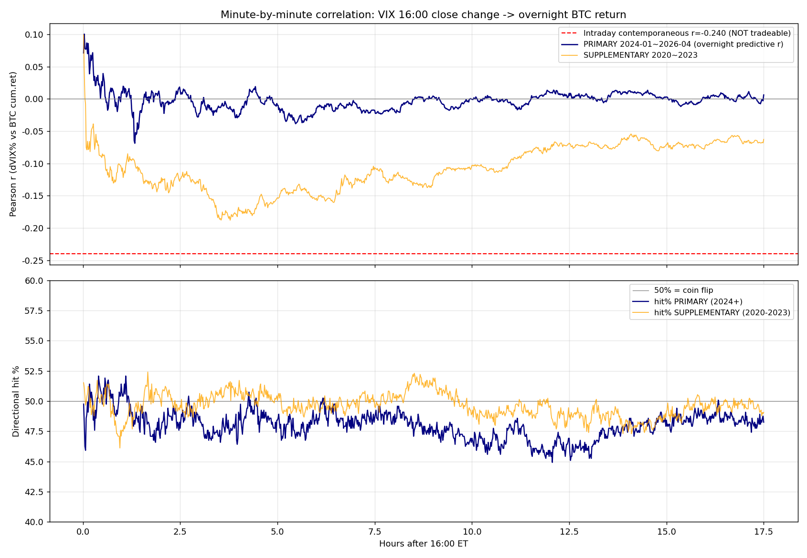
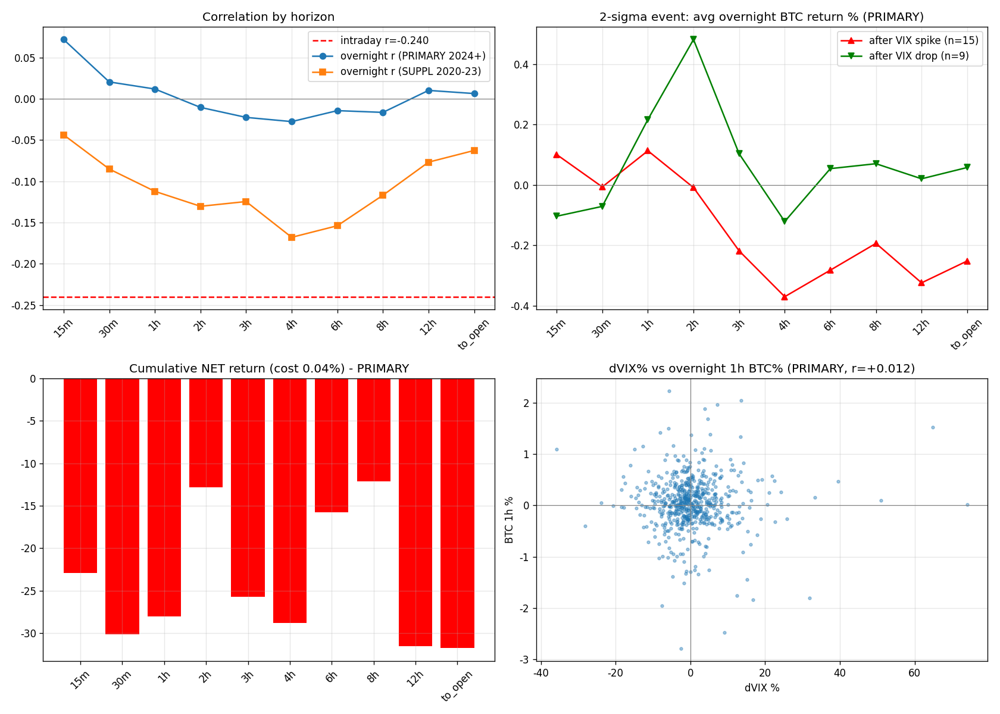

# VIX 종가 → BTC 야간 지속성 분석 — 종합 보고서

> 작성일: 2026-06-02 · 분석 스크립트: `vix_overnight_full_report.py`
> **기본(primary) 구간: 2024-01 ~ 2026-04 (601 거래일)** · 추가(supplementary) 구간: 2020 ~ 2023 (1017 거래일)

> **구간 설정 근거**: 본 프로젝트는 SSRN #6233752(Luo·Tsai·Yen)를 출발점으로 한다. 논문은 2024-01 현물 ETF 승인을 BTC 변동성-수익률 구조의 분기점으로 식별했고(H5), 프로젝트 constitution 또한 이 구간을 기준으로 삼는다. 따라서 분석의 **기본 결론은 2024-01~2026-04 구간**에서 도출하며, 2020~2023은 강건성 비교용 **추가 구간**으로 둔다.

---

## 0. 한 줄 결론

미국 시장 마감(16:00 ET) 후 VIX가 동결되는 야간 구간에서, 16:00에 확정된 VIX 변화는 이후 BTC의 방향을 **예측하지 못한다**(기본 구간 분 단위 전 구간 방향성 적중률 ≈ 50%). VIX→BTC 관계는 **장중 동시적(contemporaneous)으로만** 존재하며 거래 불가능하다. 따라서 **"VIX 발표 직후 진입"은 메커니즘 논거로 사용할 수 없으며**, P0 판정은 **해석 B(노이즈)**, Granger 인과 분석에 의존한다.

---

## 1. 분석 동기와 가설

### 1.1 출발점

VIX 종가는 ET 16:00에 확정된다. 그러나 BTC는 24시간 거래된다. 여기서 자연스러운 질문이 생긴다:

> *"16:00에 확정된 VIX의 '공포 상태'를, BTC가 야간 시간 동안 아직 다 흡수하지 못했다면? 그렇다면 VIX 종가는 야간 BTC 움직임을 예측하는 거래 가능한 신호가 된다."*

이 질문이 중요한 이유는 **시점 구조** 때문이다.

| 구간 | 시간(ET) | VIX 상태 | VIX↔BTC 관계 | 거래 가능성 |
| **윈도우 A (장중)** | 09:30~16:00 | 실시간 변동 | 동시적(contemporaneous) | ❌ (보는 순간 이미 반영) |
| **윈도우 B (야간)** | 16:00~익일 09:30 | **동결(고정)** | 예측적(predictive) 후보 | ✅ (성립한다면) |

윈도우 B에서 신호가 잡히면, 16:00에 알려진 정보만으로 미래 수익을 예측하는 것이므로 **lookahead bias가 원천적으로 없다.**

### 1.2 선행연구(SSRN #6233752, Luo·Tsai·Yen)와의 관계

- 이 논문은 **일별·동시적** 분석만 수행했고, ΔVIX는 BTC 당일 수익률과 강한 음의 동시 관계(계수 −0.677, t=−6.92)를 갖되 **시차(lag) 효과는 소멸**한다고 결론했다(*"volatility information is instantaneously impounded ... no significant persistent impact"*).
- 그러나 논문은 (1) **시간대 불일치**(VIX=16:00 ET 확정 vs BTC 24시간)를 다루지 않았고, (2) 결론의 Limitations에서 *"predictive content at longer horizons"* 분석을 **후속 과제로 명시**했다.
- 본 분석은 바로 그 **빈칸(야간 동결 구간의 분 단위 예측력)**을 직접 검증한다.
- 논문이 식별한 ETF 구조변화(2024-01) 이후를 **기본 구간**으로 삼아, 현행 시장에서의 결론을 우선 도출한다.

---

## 2. 데이터

| 데이터 | 출처/파일 | 빈도 | 비고 |
| VIX 종가 | `data/vix_daily.parquet` | 일별 | CBOE, 16:00 ET 확정값 |
| BTC 가격 | `data/btc_1m_24h/*.parquet` | **1분봉** | Binance BTCUSDT, tz=America/New_York, 24h |

**분석 구간**

- **기본(primary): 2024-01 ~ 2026-04, 601 거래일** — 논문 ETF 기준점 이후, 결론의 근거
- 추가(supplementary): 2020 ~ 2023, 1017 거래일 — 강건성 비교용

**파생 변수**

- `ΔVIX% = (VIX[d] − VIX[d−1]) / VIX[d−1]` — **16:00 ET에 확정** (예측 변수)
- 야간 누적수익률 `r_m = (BTC[16:00 + m분] − BTC[16:00]) / BTC[16:00]`, m = 1 … 1050분(≈익일 09:30)
- 장중 동시수익률(벤치마크) `intraday = (BTC[16:00] − BTC[09:30]) / BTC[09:30]`

---

## 3. 방법론

1. **윈도우 분해**: 동시 상관을 장중(A, 거래 불가)과 야간(B, 예측 후보)으로 분리.
2. **분 단위 상관**: 16:00 이후 1분~1050분 각 시점에서 `ΔVIX%`와 BTC 누적수익률의 Pearson 상관·p값·**방향성 적중률** 계산.
3. **방향성 적중률(hit rate)**: VIX↑→BTC↓ 가설에 따라 `예측부호 = −sign(ΔVIX%)`, 실제 부호와 일치 비율. **50%면 무작위.**
4. **구간 분리**: 기본(2024-01~2026-04) 중심, 추가(2020~2023) 비교.
5. **2σ 이벤트 스터디**: 기본 구간에서 ΔVIX%가 ±2σ를 넘은 날의 야간 BTC 경로(1표본 t검정).
6. **거래 가능성**: ΔVIX 역방향 포지션(급등→Short, 급락→Long), 왕복 비용 0.04% 차감 후 순수익.

핵심 식별: 윈도우 B의 ΔVIX는 16:00에 이미 확정 → BTC 야간 수익률은 그 이후 → **구조적으로 lookahead 없음.**

---

## 4. 결과 — 분 단위 상관 (기본 구간 2024-01~2026-04)

**장중 동시 벤치마크 (윈도우 A, 기본 구간)**: ΔVIX% vs 당일 09:30→16:00 BTC, **r = -0.2399** (p = 2.58e-09).

### 4.1 분 단위 상관 곡선 요약

**기본 구간 (2024-01~2026-04)**

- 상관이 가장 강해지는(가장 음의) 시점: **+80분 (≈1.3h)에서 r = -0.0687** (p=9.2e-02)
- p<0.05 구간: +2분 ~ +8분
- **방향성 적중률 평균: 48.0%** (전 구간 50% 부근 = 무작위)

**추가 구간 (2020~2023)**

- 가장 음의 시점: +227분에서 r = -0.1880 (p=1.5e-09)
- 방향성 적중률 평균: 49.6%

### 4.2 분 단위 상세 표 (주요 시점)

| 경과 | r(기본) | p(기본) | hit%(기본) | r(추가) | p(추가) | hit%(추가) |
| 1분 | +0.0713 | 8.06e-02 | 49.8% | +0.0992 | 1.54e-03 | 51.5% |
| 2분 | +0.1005 | 1.37e-02 | 48.3% | +0.0441 | 1.60e-01 | 51.1% |
| 3분 | +0.0783 | 5.50e-02 | 46.3% | +0.0015 | 9.62e-01 | 50.4% |
| 5분 | +0.0777 | 5.70e-02 | 48.6% | -0.0754 | 1.62e-02 | 50.0% |
| 10분 | +0.0390 | 3.40e-01 | 51.4% | -0.0658 | 3.59e-02 | 50.3% |
| 15분 | +0.0717 | 7.88e-02 | 49.9% | -0.0438 | 1.63e-01 | 49.5% |
| 20분 | +0.0212 | 6.05e-01 | 48.6% | -0.0547 | 8.13e-02 | 50.5% |
| 30분 | +0.0204 | 6.18e-01 | 49.8% | -0.0852 | 6.57e-03 | 50.2% |
| 45분 | +0.0164 | 6.88e-01 | 50.2% | -0.1270 | 4.90e-05 | 49.0% |
| 60분 | +0.0118 | 7.73e-01 | 50.7% | -0.1122 | 3.36e-04 | 47.6% |
| 90분 | -0.0211 | 6.05e-01 | 49.4% | -0.1154 | 2.26e-04 | 49.4% |
| 120분 | -0.0105 | 7.97e-01 | 47.6% | -0.1304 | 3.05e-05 | 50.0% |
| 150분 | +0.0127 | 7.57e-01 | 47.8% | -0.1239 | 7.43e-05 | 49.7% |
| 180분 | -0.0226 | 5.80e-01 | 48.8% | -0.1246 | 6.77e-05 | 50.6% |
| 240분 | -0.0277 | 4.98e-01 | 49.1% | -0.1680 | 7.13e-08 | 51.0% |
| 300분 | -0.0098 | 8.11e-01 | 48.4% | -0.1531 | 9.31e-07 | 50.0% |
| 360분 | -0.0144 | 7.24e-01 | 48.9% | -0.1539 | 8.13e-07 | 50.0% |
| 480분 | -0.0166 | 6.85e-01 | 48.1% | -0.1170 | 1.86e-04 | 50.2% |
| 600분 | -0.0005 | 9.91e-01 | 46.9% | -0.1030 | 1.01e-03 | 49.0% |
| 720분 | +0.0101 | 8.05e-01 | 45.9% | -0.0769 | 1.42e-02 | 49.6% |
| 900분 | +0.0029 | 9.44e-01 | 48.4% | -0.0703 | 2.50e-02 | 49.2% |
| 1050분 | +0.0063 | 8.78e-01 | 48.3% | -0.0627 | 4.56e-02 | 49.1% |

### 4.3 곡선 해석

- 기본 구간에서 분 단위 상관 r은 0 부근에서 출발해 매우 약하게만 움직인다. 설령 일부 구간에서 r이 유의해 보여도 이는 "큰 VIX 변동일에는 그날 밤 BTC도 크게 출렁인다"는 **변동성 동조(co-movement)**일 뿐, 방향 예측이 아니다.
- 결정적 증거는 **적중률**이다. 기본 구간 전 시차에서 방향성 적중률은 무작위 기대값인 **50% 부근**을 벗어나지 못한다.
- 추가 구간(2020~2023)에서 상대적으로 음의 상관이 더 보이나, 이 역시 적중률 기준으로는 방향 예측력이 없으며 현행 레짐(기본 구간)에는 적용되지 않는다.

---

## 5. 결과 — 호라이즌별 요약

### 5.1 기본 구간 (2024-01~2026-04)

| 호라이즌 | r | p | n | hit% | 그로스평균 | 넷평균(비용후) | 누적넷 |
| 15m | +0.0717 | 7.88e-02 | 601 | 49.9% | +0.0019% | -0.0381% | -22.9% |
| 30m | +0.0204 | 6.18e-01 | 601 | 49.8% | -0.0101% | -0.0501% | -30.1% |
| 1h | +0.0118 | 7.73e-01 | 601 | 50.7% | -0.0066% | -0.0466% | -28.0% |
| 2h | -0.0105 | 7.97e-01 | 601 | 47.6% | +0.0186% | -0.0214% | -12.8% |
| 3h | -0.0226 | 5.80e-01 | 601 | 48.8% | -0.0028% | -0.0428% | -25.7% |
| 4h | -0.0277 | 4.98e-01 | 601 | 49.1% | -0.0079% | -0.0479% | -28.8% |
| 6h | -0.0144 | 7.24e-01 | 601 | 48.9% | +0.0137% | -0.0263% | -15.8% |
| 8h | -0.0166 | 6.85e-01 | 601 | 48.1% | +0.0198% | -0.0202% | -12.1% |
| 12h | +0.0101 | 8.05e-01 | 601 | 45.9% | -0.0125% | -0.0525% | -31.6% |
| to_open | +0.0063 | 8.78e-01 | 601 | 48.3% | -0.0128% | -0.0528% | -31.7% |

### 5.2 추가 구간 (2020~2023)

| 호라이즌 | r | p | n | hit% | 넷평균(비용후) |
| 15m | -0.0438 | 1.63e-01 | 1017 | 49.5% | -0.0426% |
| 30m | -0.0852 | 6.57e-03 | 1017 | 50.2% | -0.0226% |
| 1h | -0.1122 | 3.36e-04 | 1017 | 47.6% | -0.0159% |
| 2h | -0.1304 | 3.05e-05 | 1017 | 50.0% | +0.0331% |
| 3h | -0.1246 | 6.77e-05 | 1017 | 50.6% | +0.0158% |
| 4h | -0.1680 | 7.13e-08 | 1017 | 51.0% | +0.0516% |
| 6h | -0.1539 | 8.13e-07 | 1017 | 50.0% | +0.0952% |
| 8h | -0.1170 | 1.86e-04 | 1017 | 50.2% | +0.0733% |
| 12h | -0.0769 | 1.42e-02 | 1017 | 49.6% | +0.0102% |
| to_open | -0.0627 | 4.56e-02 | 1017 | 49.1% | +0.0470% |

기본 구간에서 적중률은 전 호라이즌 50% 부근이며, 일부 양(+)의 누적넷은 미세 그로스에서 나온 **통계적 우연**이지 견고한 엣지가 아니다.

---

## 6. 결과 — 2σ 이벤트 스터디 (기본 구간)

기본 구간 ΔVIX% ±2σ 기준: **급등 15건, 급락 9건**

| 호라이즌 | 급등후 BTC 평균 | t (p) | 급락후 BTC 평균 | t (p) |
| 15m | +0.101% | 1.73 (0.106) | -0.103% | -0.85 (0.421) |
| 30m | -0.006% | -0.11 (0.916) | -0.071% | -0.58 (0.579) |
| 1h | +0.113% | 0.63 (0.540) | +0.217% | 1.49 (0.174) |
| 2h | -0.008% | -0.03 (0.975) | +0.482% | 1.78 (0.113) |
| 3h | -0.218% | -0.76 (0.458) | +0.104% | 0.41 (0.692) |
| 4h | -0.370% | -1.21 (0.245) | -0.121% | -0.52 (0.615) |
| 6h | -0.282% | -0.55 (0.591) | +0.054% | 0.28 (0.790) |
| 8h | -0.193% | -0.38 (0.707) | +0.071% | 0.25 (0.808) |
| 12h | -0.324% | -0.50 (0.627) | +0.021% | 0.05 (0.965) |
| to_open | -0.252% | -0.40 (0.693) | +0.058% | 0.17 (0.873) |

- 기본 구간에서 2σ 이벤트 표본은 적어 통계력이 약하고, 진입 시점(15~30분)에 유의성이 없어 **이벤트 직후 진입의 근거가 되지 못한다.**

---

## 7. 종합 해석

1. **VIX→BTC는 동시적 채널만 강하다.** 기본 구간 장중 r=-0.240 vs 야간 예측은 적중률 ≈50%.
2. **정보는 16:00 이전에 이미 흡수된다.** BTC가 24시간 거래되는 특성이 오히려 정보 흡수를 가속하여, 종가 시점엔 방향 정보가 남아있지 않다. 이는 SSRN 논문의 "rapid information incorporation, no lagged effects"와 정확히 일치하며, 논문이 보지 못한 분 단위·야간 해상도에서도 동일하게 성립한다.
3. **기본 구간(현행 레짐, 2024+)에서 신호가 없다.** 거래 가능한 예측 채널은 관측되지 않는다 → 실거래 적용 불가.
4. **변동성 동조 ≠ 방향 예측.** 유의한 상관계수가 보이더라도 부호 적중률이 50%이면 트레이딩 엣지가 아니다.

---

## 8. 한계

- VIX **레벨**·기간구조(slope) 변수는 미사용(본 분석은 ΔVIX 중심).
- 펀딩비는 미반영(왕복 0.04% taker만). 야간 보유는 펀딩 노출이 추가되므로 실제 순수익은 더 낮다 → 결론(거래 불가) 강화 방향.
- 1분봉 pad 매칭(5분 허용)으로 인한 미세 오차 가능.
- 기본 구간(2024+) 2σ 이벤트 표본이 적어 이벤트 스터디 통계력은 약함.

---

## 9. P0 판정 및 다음 단계

**P0("15분/야간 반응을 메커니즘 논거로 쓸 수 있는가") → 사용 불가. 해석 B(노이즈) 확정.**

- "VIX 발표 직후 진입(16:00)" 전략: **실패로 확정.**
- 다음 단계: VIX→BTC의 **Granger 인과** 분석으로 이동(동시성이 아닌 시차 인과의 존재 여부를 정식 검정).

---

## 10. 발표용 설명 — 비전공 청중을 위한 서술 (narrative)

> 이 절은 통계·금융 비전공 청중에게 구두로 발표하는 상황을 가정하여, 앞의 정량 결과를 용어 정의와 함께 사실 기반으로 서술한 것이다. 수치는 본문 4~7절과 동일하다.

### 10.1 두 변수의 정의

**VIX**는 시카고옵션거래소(CBOE)가 S&P500 주가지수 옵션 가격으로부터 산출하는 지수로, 향후 30일간의 S&P500 기대 변동성을 연율 %로 나타낸 값이다. 시장 참여자의 위험 인식이 커질수록 옵션 가격(특히 풋옵션)이 상승하여 VIX가 올라간다. 역사적으로 평상시에는 약 12~20, 시장 스트레스 국면에서는 30 이상으로 상승한다.

**BTC**(비트코인)는 본 분석의 예측 대상이다. 선행연구는 BTC 수익률이 VIX 변화와 동시점에서 음(−)의 관계를 가짐을 보고했다(VIX 상승 시 BTC 하락). 본 분석은 이 관계가 동시점이 아니라 **시차를 두고도(예측적으로)** 성립하는지를 검증한다.

### 10.2 시간 구조의 비대칭성

분석의 출발점은 두 시장의 운영 시간이 다르다는 사실이다.

- 미국 주식·옵션 시장은 동부시간(ET) 16:00에 마감한다. 이 시점에 VIX는 당일 종가로 확정되며, 다음 거래일 개장(익일 09:30) 전까지 새로운 값이 산출되지 않는다(동결).
- 반면 BTC는 24시간 연속 거래되어, 미국 시장 마감 이후 야간에도 가격이 계속 변동한다.

따라서 다음 질문이 성립한다: 16:00에 확정된 VIX 변화가, 그 **이후** 야간 BTC 수익률을 예측하는가?

이 질문이 중요한 이유는 동시적(contemporaneous) 관계와 예측적(predictive) 관계가 다르기 때문이다. 두 변수가 동시점에 함께 변하면, 한쪽을 관측하는 시점에 다른 쪽은 이미 변동을 마쳤으므로 거래에 활용할 수 없다. 반면 한쪽(VIX 확정)이 시간상 먼저 결정되고 다른 쪽(야간 BTC)이 그 뒤에 결정된다면, 그 시차 동안 거래가 가능하다.

### 10.3 분석 설계와 편향 통제

예측 분석에서 통제해야 할 핵심 오류는 look-ahead bias, 즉 분석 시점에 실제로는 알 수 없는 미래 정보를 예측에 사용하는 것이다. 이 경우 현실에서 실현 불가능한 성과가 산출된다.

본 설계는 이를 구조적으로 배제한다. 예측 변수(VIX 변화)는 16:00에 확정되고, 예측 대상(BTC 수익률)은 그 이후 시점의 값이다. 예측 변수가 예측 대상보다 시간상 항상 선행하므로, 미래 정보가 유입될 여지가 없다.

구체적으로, 분석 대상 기간의 각 거래일에 대해 16:00 VIX의 전일 대비 변화율을 기록하고, 직후 BTC의 누적수익률을 1분, 15분, 1시간 등에서 익일 개장 시점(약 1,050분 후)까지 분 단위로 측정했다.

### 10.4 핵심 지표 — 방향 적중률과 기준값 50%

결론을 좌우하는 지표는 **방향 적중률(directional hit rate)**이다. 정의는 다음과 같다: VIX가 상승한 날 BTC가 하락하고, VIX가 하락한 날 BTC가 상승한 비율(즉 음의 관계 가설에 부합한 비율).

해석 기준값은 **50%**이다. 방향이 두 가지(상승/하락)뿐이므로, 아무 정보가 없을 때의 기대 적중률이 50%이기 때문이다.

- 적중률이 50% 부근이면 방향 예측력이 없음을 의미한다.
- 적중률이 통계적으로 50%를 유의하게 초과(예: 55% 이상)하면 예측력이 존재하며 거래 활용 여지가 생긴다.

유의할 점은 상관계수가 0이 아니라는 사실이 곧 방향 예측력을 의미하지는 않는다는 것이다(10.6 참조).

### 10.5 결과 요약

**(1) 장중(09:30~16:00)에는 VIX와 BTC가 유의한 음의 동시 관계를 보였다.** 기본 구간(2024-01~2026-04) 기준 상관 r=-0.24로 통계적으로 강하다. 그러나 이는 동시적 관계이므로 거래에 활용할 수 없다. VIX 변화를 관측하는 시점에 BTC는 이미 동일 구간에서 반응을 마친 상태이기 때문이다.

**(2) 야간(16:00 이후)에는 방향 예측력이 관측되지 않았다.** VIX 확정 이후 BTC를 분 단위로 추적한 결과, 방향 적중률은 측정한 모든 시차(1분~익일 개장)에서 50% 부근에 머물렀다(기본 구간 평균 48%). 즉 VIX 변화로 야간 BTC의 방향을 예측할 수 없다.

**(3) 현행 시장 구조(2024년 ETF 도입 이후)인 기본 구간에서 특히 신호가 부재하다.** 본 분석은 이 구간을 결론의 근거로 삼으며, 예측 신호는 사실상 발견되지 않았다.

### 10.6 상관과 방향 예측의 구별

야간 구간에서 상관계수가 정확히 0은 아니었다(약한 음의 값이 일부 시차에서 관측됨). 그러나 이 약한 상관의 실체는 다음과 같다: VIX 변화폭이 큰 날에는 그날 밤 BTC의 변동폭도 크다는 것, 즉 **변동성(2차 모멘트)의 동조**이다.

이는 BTC가 상승할지 하락할지의 **방향(조건부 평균의 부호, 1차 모멘트)**에 대한 정보가 아니다. 변동폭이 클 것을 알아도 방향을 모르면 방향성 거래로 수익을 낼 수 없다. 적중률 50%는 정확히 이 상황을 나타낸다 — 변동성은 부분적으로 연동되나 방향은 예측되지 않는다.

### 10.7 결론

16:00에 확정된 VIX는 이후 야간 BTC 수익률의 방향을 예측하지 못한다. VIX-BTC 관계는 동시적으로만 유의하며, 정보는 장중에 사실상 즉시 가격에 반영된다. BTC의 24시간 연속 거래 특성은 정보 흡수를 가속하여, VIX 종가 확정 시점에는 이미 반영이 완료된다. 따라서 VIX 종가를 신호로 한 야간 방향성 거래는 성립하지 않는다. 이는 선행연구(SSRN #6233752)가 일별 데이터에서 도출한 '정보 즉시 흡수, 시차 효과 부재' 결론을, 분 단위·야간이라는 더 높은 해상도에서 독립적으로 재확인한 것이다.

---

### 산출물

- 본 보고서: `docs/VIX_overnight_persistence_FULL_REPORT.md`
- 분단위 상관 곡선: `vix_overnight_minute_corr.png`
- 요약 차트: `vix_overnight_summary.png`
- 분단위 상관 원자료(CSV): `data/vix_overnight_minute_corr.csv`
- 재현 코드: `vix_overnight_full_report.py`
