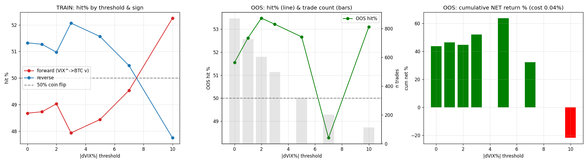

# VIX → BTC 방향성 재검증 — 임계 필터 + 부호 데이터 결정

> 작성일 2026-06-02 · 코드 `vix_threshold_directional.py`
> 표본: 2020-01-03 ~ 2026-05-22, 총 1634 Trade Day

## 0. 무엇을, 왜, 어떻게 바꿨나

기존 야간/Granger 분석의 방향성 검증은 **단일 룰**이었다:
```
예측부호 = -sign(ΔVIX%)   # VIX 조금이라도 오르면 무조건 숏, All 표본 Mean
```
이 룰의 두 가지 약점을 본 분석에서 교정한다.

| 약점 | 본 분석의 교정 |
|---|---|
| 미세 변화도 무조건 베팅(노이즈 흡수) | **① 임계 필터**: |ΔVIX%|>임계인 '큰 변화'에만 베팅, 그 사이 관망 |
| 'VIX↑→BTC↓' 부호를 사람이 미리 가정 | **⑤ 부호 데이터 결정**: train에서 정/역 부호를 학습 → OOS 검증 |

**핵심 식별**: 신호 ΔVIX%는 t시점 16:00에 확정 → 타깃은 t→t+1 수익률(`shift(-1)`) → lookahead-free.

## 1. 데이터 · 정의
| 항목 | 값 |
|---|---|
| 신호 | ΔVIX% = VIX 종가 전일 대비 변화율 (16:00 ET 확정) |
| 타깃 | 다음 Trade Day BTC Return (16:00→16:00 close-to-close) |
| 표본 | 1634일 (2020-01-03~2026-05-22) |
| Train | 760일 (~2022-12) → 부호 학습 |
| OOS | 874일 (2023-01~) → 검증 (건드리지 않음) |
| 비용 | 왕복 0.04% (taker) |
| 임계 격자 | [0, 1, 2, 3, 5, 7, 10] (|ΔVIX%|, 단위 %) |
| 부호 | +1 정방향(VIX↑→BTC↓) / −1 역방향(VIX↑→BTC↑) |

## 2. 방법론
1. **임계 필터**: |ΔVIX%|>thr인 날만 거래. thr=0이면 모든 날(=기존 단일 룰과 동일).
2. **부호 학습(⑤)**: train 구간에서 각 임계별로 정방향/역방향 중 **적중률 높은 부호**를 선택.
3. **OOS 검증**: train에서 고른 부호를 OOS에 적용. train 정보만으로 결정 → 미래 누수 없음.
4. **이항검정**: 적중 횟수가 n회 중 50%를 유의하게 벗어나는지 양측 binomial test.
5. **다중검정 보정**: 임계 7개 검정 → Bonferroni 임계 p<0.0071.
6. **거래 가능성**: 적중률뿐 아니라 비용 차감 후 누적 순수익으로 최종 판단.

## 3. TRAIN 결과 — 임계별·부호별 적중률
(train에서 어느 부호가 우세한지 관찰. 이 단계는 '학습'이며 성과 주장 아님.)

| 임계 |ΔVIX%|> | 부호 | train n | train hit% | train 누적넷% |
|---|---|---|---|---|
| 0 | 정방향(VIX↑→BTC↓) | 756 | 48.7% | +7.2% |
| 0 | 역방향(VIX↑→BTC↑) | 756 | 51.3% | -67.7% |
| 1 | 정방향(VIX↑→BTC↓) | 669 | 48.7% | +64.3% |
| 1 | 역방향(VIX↑→BTC↑) | 669 | 51.3% | -117.9% |
| 2 | 정방향(VIX↑→BTC↓) | 567 | 49.0% | +95.1% |
| 2 | 역방향(VIX↑→BTC↑) | 567 | 51.0% | -140.5% |
| 3 | 정방향(VIX↑→BTC↓) | 484 | 47.9% | +57.9% |
| 3 | 역방향(VIX↑→BTC↑) | 484 | 52.1% | -96.6% |
| 5 | 정방향(VIX↑→BTC↓) | 320 | 48.4% | +53.7% |
| 5 | 역방향(VIX↑→BTC↑) | 320 | 51.6% | -79.3% |
| 7 | 정방향(VIX↑→BTC↓) | 214 | 49.5% | +46.4% |
| 7 | 역방향(VIX↑→BTC↑) | 214 | 50.5% | -63.5% |
| 10 | 정방향(VIX↑→BTC↓) | 111 | 52.3% | +23.1% |
| 10 | 역방향(VIX↑→BTC↑) | 111 | 47.7% | -32.0% |

**train에서 선택된 부호(임계별):**

| 임계 | 선택 부호 | train hit% | train n |
|---|---|---|---|
| 0 | 역방향(VIX↑→BTC↑) | 51.3% | 756 |
| 1 | 역방향(VIX↑→BTC↑) | 51.3% | 669 |
| 2 | 역방향(VIX↑→BTC↑) | 51.0% | 567 |
| 3 | 역방향(VIX↑→BTC↑) | 52.1% | 484 |
| 5 | 역방향(VIX↑→BTC↑) | 51.6% | 320 |
| 7 | 역방향(VIX↑→BTC↑) | 50.5% | 214 |
| 10 | 정방향(VIX↑→BTC↓) | 52.3% | 111 |

## 4. OOS 결과 — 핵심 (train에서 고른 부호로 검증)

| 임계 | 선택부호 | OOS n | OOS hit% | 이항 p | 비용후 누적넷% | 판정 |
|---|---|---|---|---|---|---|
| 0 | 역방향(VIX↑→BTC↑) | 869 | 51.6% | 0.378 | +43.8% | 무의미(≈50%) |
| 1 | 역방향(VIX↑→BTC↑) | 726 | 52.6% | 0.170 | +46.4% | 무의미(≈50%) |
| 2 | 역방향(VIX↑→BTC↑) | 604 | 53.5% | 0.095 | +44.7% | 무의미(≈50%) |
| 3 | 역방향(VIX↑→BTC↑) | 498 | 53.2% | 0.165 | +52.2% | 무의미(≈50%) |
| 5 | 역방향(VIX↑→BTC↑) | 319 | 52.7% | 0.370 | +63.8% | 무의미(≈50%) |
| 7 | 역방향(VIX↑→BTC↑) | 203 | 48.3% | 0.674 | +32.3% | 무의미(≈50%) |
| 10 | 정방향(VIX↑→BTC↓) | 113 | 53.1% | 0.573 | -21.8% | 무의미(≈50%) |

- Bonferroni 임계: p < 0.0071
- 베이스라인(기존 단일 룰, thr=0 정방향, All기간): hit 48.6%, 누적넷 -106.2%



## 5. 해석
- ❌ **OOS에서 50%를 유의하게 초과하는 임계 없음.** 부호를 데이터로 학습하고 큰 변화만 걸러도 방향 예측 불가.

- 임계를 높일수록(큰 VIX Change만) 표본 수가 급감 → 적중률이 흔들려도 우연 구분 어려움(이항 p가 커짐).
- train에서 좋아 보인 부호가 OOS에서 유지되는지가 관건. 유지 안 되면 train 적중률은 과적합.

## 6. 한계
- 일별 close-to-close 타깃만 검증(Intraday·야간 분리는 별도). 펀딩비 미반영(반영 시 순수익 하락 → 결론 강화 방향).
- 고임계 구간 표본 부족 → 통계력 약함. 임계·부호 격자 탐색의 다중검정은 Bonferroni로 보정했으나 보수적.
- 부호 학습을 train 적중률 기준으로 했음. 누적수익 기준 등 대안 학습규칙은 미검토.
- 단일 train/OOS 분할(2023 경계). 워크포워드 다분할은 후속 과제.

## 7. 결론
**임계 필터(①)와 부호 데이터 학습(⑤)을 적용해도 VIX→BTC 방향 예측은 OOS에서 동전 던지기를 넘지 못한다.** 기존 단일 룰의 '방향 예측 불가' 결론은 더 정교한 결정규칙에서도 견고하게 유지된다.

### 산출물
- 보고서: `new/vix_threshold_directional_report.md`
- 차트: `new/vix_threshold_grid.png`
- 원자료(격자+OOS): `new/vix_threshold_directional.csv`
- 코드: `new/vix_threshold_directional.py`